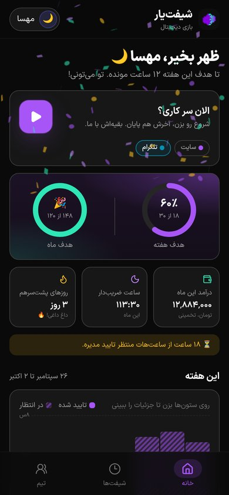
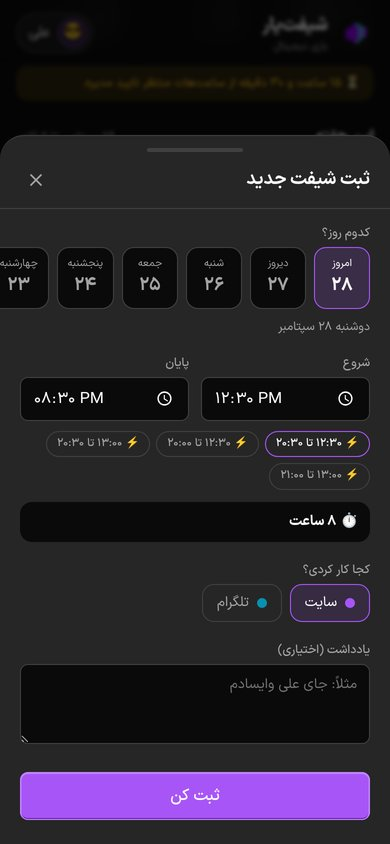
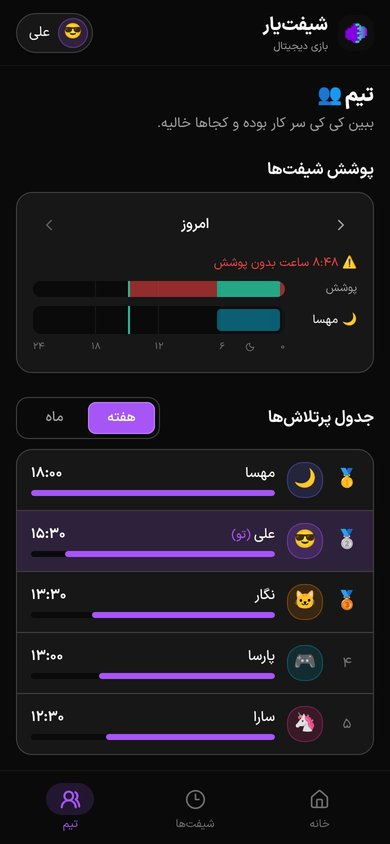
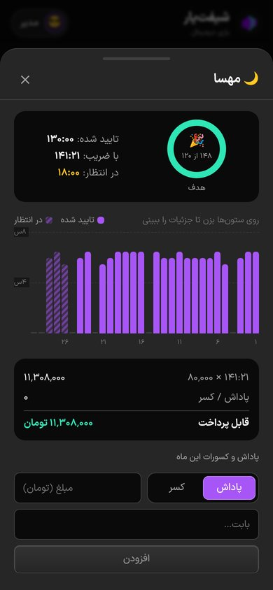

<div align="center">


# ShiftYar · شیفت‌یار

**Mobile-first shift tracking and payroll for support teams, in Persian (RTL).**

Employees log their hours or clock in with one tap. Admins approve shifts, set goals and
pay rates, and get weekly and monthly payroll with night-shift bonuses worked out for them.

[](https://github.com/Bazi-Digital/shift-app/actions/workflows/ci.yml)
[](LICENSE)






</div>

> **فارسی:** شیفت‌یار یک اپلیکیشن موبایل‌محور برای ثبت ساعت کاری و محاسبه حقوق تیم‌های پشتیبانی است.
> کارمندها ساعت‌هایشان را ثبت می‌کنند یا با یک دکمه شیفت را شروع و تمام می‌کنند. مدیرها شیفت‌ها را تایید می‌کنند،
> هدف و نرخ ساعتی تعیین می‌کنند و گزارش هفتگی و ماهانه‌ی حقوق را با احتساب ضریب شیفت شب می‌بینند.

## Why

Our buy/sell support team used to track hours in a Google Sheet: one tab per month, a row for
every half hour and people's names typed into the cells. Totals and night-shift weighting
were spreadsheet formulas. It worked, but it was tedious to fill in, easy to get wrong, and
nobody enjoyed opening it. ShiftYar replaces that sheet with something the team actually
wants to use on their phones.

## Features

**For employees**
- ▶️ **One-tap clock in/out** with a live timer, or log a past shift in a few taps (day chips, your usual hours as presets, overnight shifts detected automatically)
- 🎯 **Weekly and monthly goal rings**, with confetti when you hit one 🎉
- 💰 **Live earnings estimate** for the month, including night-shift bonuses
- 🔥 **Streaks** for consecutive working days
- 👥 **Team view**: a 24-hour coverage timeline showing who worked when, plus an optional hours leaderboard
- 😎 Pick your emoji avatar and color

**For admins**
- ✅ **Approval queue**: approve in bulk, or reject with a note the employee will see
- 📊 **Weekly and monthly payroll reports**: approved, weighted, pending and bonus hours, adjustments, and the total to pay. **CSV export** opens correctly in Excel
- 🌙 **Pay-rate rules**: e.g. 00:00–06:00 at +10%, or Fridays at +50%. Rules can cross midnight and be limited to weekdays
- 🎁 **Bonuses and deductions** per person per month
- 🟥 **Coverage gaps**: see at a glance which hours nobody covered
- 🟢 **Who's on shift now**
- 👥 **Teams**, e.g. Website and Telegram, so you can see which team each shift was for. The API and code call these "channels"
- 📅 **Gregorian or Jalali (Solar Hijri)** months, Saturday-start weeks, company timezone
- 🎨 **Your branding**: upload a company logo and set the company name in Settings. They appear in the header, on the login page and as the browser tab icon
- 🔒 Configurable edit window, approval requirement and maximum shift length

**Under the hood**: a single Go binary serves the API and the built SPA, backed by SQLite or PostgreSQL. It ships as an installable PWA and the login endpoint is rate-limited.

## How pay is calculated

Each shift is split minute by minute in the company timezone:

```
weighted minutes = Σ minute × multiplier(minute)
pay              = weighted hours × hourly rate + adjustments
```

The `multiplier` is the **highest** matching active rule, or 1×. Rules don't stack. For example, a
22:00 → 02:00 shift with the default night rule (00:00–06:00, +10%) at 100,000/h is
`2h × 1.0 + 2h × 1.1 = 4.2 weighted h → 420,000`.

Only **approved** shifts count toward pay. Pending hours appear separately as an estimate.
A shift that crosses midnight, or a month boundary, is split between the days or periods it covers.

## Quick start

### Docker (single container, SQLite)

```bash
ADMIN_PASSWORD=choose-a-strong-one docker compose up --build
```

Open <http://localhost:8080> and sign in as `admin`.

### Local development

Requirements: Go 1.26+ and Node 22+.

```bash
cp .env.example .env
make setup
make demo          # API on :8080 with 5 sample employees (password: demo1234)
make dev-frontend  # UI on http://localhost:5173 with hot reload
```

Demo logins: `admin` / `admin12345` (from `.env`), and `sara`, `ali`, `parsa`, `mahsa`, `negar` / `demo1234`.

`make test` runs the Go tests (including HTTP integration tests) and the TypeScript type check.

## Configuration

The server is configured with environment variables. Everything else, such as calendar, currency and rules, is set in the app's **Settings** page.

| Variable | Default | Description |
|---|---|---|
| `PORT` | `8080` | HTTP port |
| `DB_DRIVER` | `sqlite` | `sqlite` or `postgres` |
| `DB_DSN` | `data/shiftyar.db` | SQLite file path or PostgreSQL DSN |
| `JWT_SECRET` | random | Session signing key. **Set it in production**, otherwise everyone is logged out on restart |
| `ADMIN_USERNAME` / `ADMIN_PASSWORD` | — | Creates the first admin if none exists |
| `ADMIN_NAME` | `مدیر` | Display name for that admin |
| `STATIC_DIR` | — | Serve the built frontend from this directory |
| `CORS_ORIGINS` | — | Comma-separated origins, if the UI is hosted elsewhere |
| `TRUSTED_PROXIES` | private ranges | Proxies allowed to set `X-Forwarded-For` |

## Deployment

`deploy/deploy.sh` deploys to any Docker host you can SSH into. It runs the app and PostgreSQL
with Docker Compose behind the host's nginx.

```bash
cp deploy/deploy.env.example deploy/deploy.env   # set DEPLOY_HOST, DOMAIN, ...
deploy/deploy.sh            # first run: generates secrets and prints the admin login
deploy/deploy.sh setup      # once DNS points at the server: nginx vhost + HTTPS via certbot
```

Every `deploy` run:
1. runs the tests locally
2. uploads the source
3. **backs up the database** (the last 14 dumps are kept)
4. builds the image on the server, or pulls one when `IMAGE=` is set
5. starts it and waits for `/api/health` to report the new version
6. **rolls back automatically** if the new version doesn't come up healthy

Other commands: `status`, `logs`, `backup`, `restore <file>`, `rollback`, `credentials`, `help`.

**Prebuilt images:** on every push to `main`, the *Release image* workflow publishes
`ghcr.io/<owner>/shiftyar:sha-<commit>` and `:latest`. To deploy one without building on the server:

```bash
IMAGE=ghcr.io/bazi-digital/shiftyar:latest deploy/deploy.sh
```

Server layout (`/opt/shiftyar`): `src/` holds the uploaded source, `.env` the generated secrets
(mode 600), `backups/` the database dumps, and `admin-credentials.txt` the initial admin login.

## Project structure

```
backend/                 Go API (Gin + GORM)
  cmd/server/            entry point (--demo seeds sample data)
  internal/api/          HTTP handlers + integration tests
  internal/calc/         pay rules, weighting, week/month periods
  internal/jalali/       Jalali ↔ Gregorian conversion
  internal/models/       database models
  internal/store/        DB connection, migrations, seed data
frontend/                React 19 + Vite + Tailwind v4 + TanStack Query
  src/pages/employee/    home, my shifts
  src/pages/admin/       dashboard, approvals, report, people, settings
  src/components/        UI kit, charts, shift form
deploy/                  production compose, nginx template, deploy.sh
```

## API

All routes are under `/api` and use JSON. Authenticate with `Authorization: Bearer <token>` from `POST /auth/login`.

| | Route | |
|---|---|---|
| Auth | `POST /auth/login` | username + password → token |
| Branding | `GET /branding`, `GET /logo?v=` | public company name, logo version and logo image |
| Me | `GET/PATCH /me` | profile, settings, channels, rules; change avatar, color or password |
| Shifts | `GET/POST /shifts`, `PATCH/DELETE /shifts/:id` | `{date, start: "HH:MM", end: "HH:MM", channelId, note}`; an end at or before the start means overnight |
| Clock | `GET /shifts/active`, `POST /shifts/clock-in`, `POST /shifts/clock-out` | |
| Reports | `GET /summary?period=week\|month&offset=-1` | own totals, daily breakdown and streak (admins: `&userId=`) |
| Team | `GET /coverage?date=`, `GET /leaderboard?period=` | |
| Admin | `/admin/users`, `/admin/channels`, `/admin/rules`, `/admin/settings`, `/admin/logo` (POST multipart `logo`, DELETE), `/admin/adjustments`, `/admin/shifts/review`, `/admin/live`, `/admin/report`, `/admin/report.csv` | |

## Contributing

Contributions are welcome. See [CONTRIBUTING.md](CONTRIBUTING.md). Please report security issues privately as described in [SECURITY.md](SECURITY.md).

## License

[MIT](LICENSE) © Bazi Digital. The IRANSansX font files in `frontend/public/fonts` are licensed separately by their authors and are not covered by the MIT license. Replace them if you don't hold a license.
